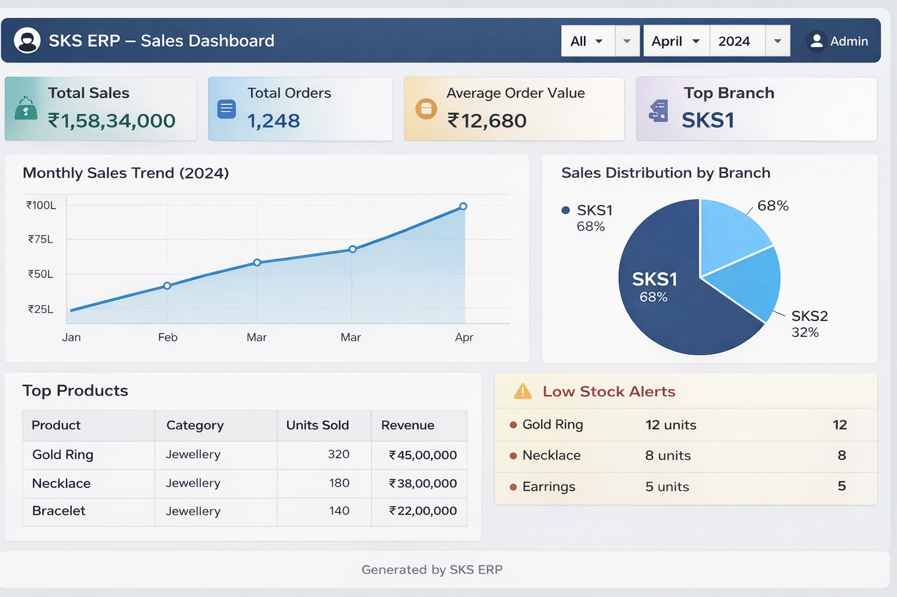

# 🏪 ERP – Retail & E-Commerce Analytics System

**A data-driven ERP system designed for small-to-mid retail businesses to optimize sales, inventory, and operations through structured data, dashboards, and insights.**

---

## 🚀 Project Overview

**ERP-Gold-Shop** is a web-based **Enterprise Resource Planning (ERP)** system tailored for retail and showroom-based businesses such as gold shops and multi-branch specialty stores.

The system replaces manual workflows with a centralized, analytics-ready platform that enables:

- 📈 Sales performance tracking  
- 📦 Inventory optimization  
- 👥 Employee & branch-level management  
- 📊 Business intelligence and reporting  

This project is documented from a **Data / Business Analyst perspective**, emphasizing decision-making, KPIs, and structured data flows.

---

## 🎯 Business Objectives

- Improve **sales visibility** across branches  
- Enable **branch-wise performance comparison**  
- Reduce **inventory stockouts and overstocking**  
- Provide **actionable insights** to owners and managers  
- Maintain a **single source of truth** for business data  

---

## 🏗️ System Architecture (High Level)

Users (Admin / Employees)
│
▼
Web Application (PHP, HTML, CSS, JS)
│
▼
Business Logic Layer
│
▼
MySQL Relational Database

yaml
Copy code

---

## 👥 User Hierarchy & Access Control

| Role | Access Level | Responsibilities |
|----|----|----|
| Owner / Super Admin | Full Access | Business overview, reports, strategic decisions |
| Admin (Branch Head) | Branch-level | Inventory, employees, sales |
| Employee | Restricted | POS operations and transactions |

This hierarchy enables clean data segregation and accurate reporting.

---

## 📦 Core Modules & Business Value

### 🧾 Point of Sale (POS)
- Records transaction-level sales data
- Auto-generates invoices
- Acts as the primary data source for revenue analytics

**Key Metrics:**
- Daily sales  
- Average bill value  
- Transaction count  

---

### 📦 Inventory Management
- Tracks product stock, category, quantity, and pricing
- Supports reorder and procurement workflows

**Analytics Use Cases:**
- Fast-moving vs slow-moving items  
- Stock aging analysis  
- Demand pattern observation  

---

### 🛒 Procurement Module
- Vendor management
- Purchase order tracking
- Stock replenishment support

**Business Insight:**
- Vendor dependency  
- Procurement cycle efficiency  

---

### 👥 Human Resource Management
- Employee records
- Branch-wise staff mapping

**Business Angle:**
- Workforce distribution analysis  
- Role-based accountability  

---

## 📊 Sales & Analytics Dashboard

This dashboard represents the **core analytics layer** of the ERP system, designed for owners and decision-makers.



### Dashboard Highlights:
- Total Revenue Overview  
- Branch-wise Sales Distribution (SKS1 vs SKS2)  
- Monthly Sales Trends  
- Product-level Sales Summary  
- Inventory Status Snapshot  

Built to enable **quick, data-backed business decisions**.

---

## 🧠 Sample Business Insights Enabled

- Which branch contributes the highest revenue?
- How do sales vary month-over-month?
- Which products drive the most sales?
- Is inventory aligned with demand?
- Where should future stock investment focus?

---

## 🗄️ Database Schema & Data Modeling

**Core Entities:**
- employees  
- branches  
- products  
- inventory  
- sales  
- vendors  
- purchase_orders  

**Key Relationships:**
- One branch → many employees  
- One product → many sales records  
- One vendor → many purchase orders  

The schema is optimized for **joins, aggregations, and analytical queries**.

---

## 📊 Analytics-Ready Design

The system is structured so data can be easily consumed using:

- SQL queries  
- Python (EDA with Pandas)  
- BI tools (Power BI / Tableau – future scope)  

**Example SQL Query:**
```sql
SELECT branch, SUM(total_amount) AS total_sales
FROM sales
GROUP BY branch;
📁 Repository Structure
pgsql
Copy code
├── admin/          # Admin & owner dashboards
├── pages/          # Employee-facing modules
├── DB/             # Database schema & SQL files
├── Screenshots/    # UI & dashboard visuals
├── misc/           # Helper files
├── index.php
├── login.php
├── README.md
📸 Screenshots & Visuals
Includes:

Login screens

Admin dashboard

Employee dashboard

Sales and reporting views

These visuals help non-technical stakeholders quickly understand system functionality.

🛠️ Tech Stack
Layer	Technology
Frontend	HTML, CSS, Bootstrap
Backend	PHP
Database	MySQL
Visualization	Charts & Tables
Methodology	Agile SDLC

🔮 Future Enhancements
Sales forecasting and trend analysis

Customer segmentation

Advanced BI dashboards

Export-ready datasets for analytics tools

Predictive inventory planning
